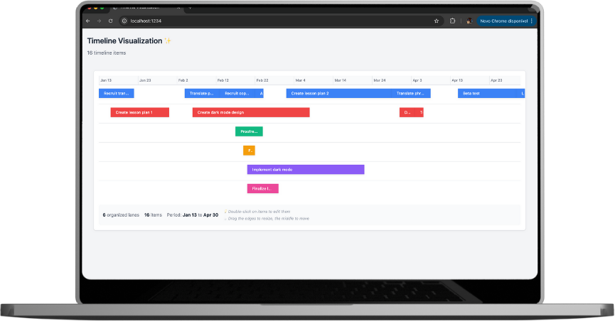
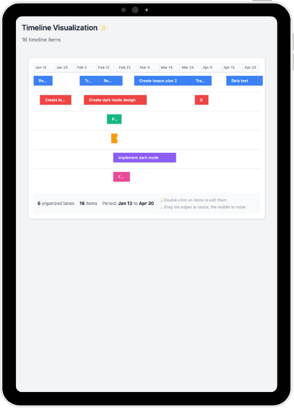

<h1 align="center">
    
</h1>

<br>

<h4 align="center">
  Interactive timeline component built with React for visualizing date-based events with smart lane assignment.
</h4>

<p align="center">
  <a href="#-features">Features</a>&nbsp;&nbsp;&nbsp;|&nbsp;&nbsp;&nbsp;
  <a href="#test_tube-technologies">Technologies</a>&nbsp;&nbsp;&nbsp;|&nbsp;&nbsp;&nbsp;
  <a href="#rocket-getting-started">Getting started</a>&nbsp;&nbsp;&nbsp;|&nbsp;&nbsp;&nbsp;
  <a href="#desktop_computer-project">Project</a>&nbsp;&nbsp;&nbsp;|&nbsp;&nbsp;&nbsp;
  <a href="#clapper-demonstration">Demonstration</a>&nbsp;&nbsp;&nbsp;|&nbsp;&nbsp;&nbsp;
  <a href="#sunny-result">Result</a>&nbsp;&nbsp;&nbsp;|&nbsp;&nbsp;&nbsp;
  <a href="#-technical-analysis">Technical Analysis</a>
</p>

---

## 🚀 Features

- **Interactive Timeline**: Visualize timeline items in horizontal lanes with optimal space utilization
- **Drag & Drop**: Move items by dragging the center, resize by dragging edges
- **Inline Editing**: Double-click any item to edit its name
- **Smart Lane Assignment**: Automatically organizes items to minimize vertical space
- **Responsive Design**: Adapts to different screen sizes with horizontal scrolling when needed
- **Real-time Updates**: Visual feedback during interactions with smooth animations
- **SOLID Architecture**: Clean, modular codebase following SOLID principles

## :test_tube: Technologies

This project was developed using the following technologies:

- [React.JS](https://reactjs.org) - UI Library
- JavaScript ES6+ - Programming Language
- CSS3 - Styling
- HTML5 - Markup
- Parcel - Build Tool

## :rocket: Getting started

To clone and run this application, you'll need [Git](https://git-scm.com), [Node.js v16+](https://nodejs.org) or higher + [npm v8+](https://www.npmjs.com/) or higher installed on your computer.

**Clone the project and access the folder:**

```bash
git clone https://github.com/Ivo-Jr/timeline-airtable.git && cd timeline
```

**Follow the steps below:**

```bash
# Install the dependencies
npm install

# Start the development server
npm start
```

The application will be available at `http://localhost:1234` (or another port if 1234 is busy).

## :desktop_computer: Project

This project is an interactive timeline component for visualizing date-based events with smart lane assignment. It demonstrates modern React development practices, clean architecture principles, and thoughtful user experience design.

### 📦 Project Structure

```
src/
├── components/Timeline/       # Timeline components
│   ├── index.js              # Main Timeline component
│   ├── TimelineItem.js       # Individual timeline item
│   ├── DragHandles.js        # Drag interaction handles
│   ├── EditableContent.js    # Inline editing component
│   ├── Lane.js               # Lane container
│   └── TimeScale.js          # Time scale ruler
├── hooks/                    # Custom React hooks
│   ├── useInlineEdit.js      # Inline editing logic
│   └── useDragAndDrop.js     # Drag and drop logic
├── services/                 # Business logic services
│   └── TimelineItemStyleService.js # Styling calculations
├── utils/                    # Utility functions
│   ├── timelineUtils.js      # Timeline calculations
│   ├── dateUtils.js          # Date manipulation
│   ├── assignLanes.js        # Lane assignment algorithm
│   └── constants.js          # Configuration constants
├── data/                     # Sample data
│   └── timelineItems.js      # Timeline items dataset
└── styles/                   # Global styles
    ├── globals.css           # Global CSS
    └── variables.css         # CSS custom properties
```

## :clapper: Demonstration

<div align="center">
  <video width="100%" controls>
    <source src="public/assets/timeline-demons.mp4" type="video/mp4">
    Your browser does not support the video tag.
  </video>
</div>

## :sunny: Result

<div align="center">
  
  <br>
  
</div>

---

## 🎯 Technical Analysis

### What I Like About This Implementation

#### **1. Clean Architecture Following SOLID Principles**

The implementation demonstrates strong software engineering principles:

- **Single Responsibility**: Each hook, service, and component has one clear purpose
- **Open/Closed**: Easy to extend with new features without modifying existing code
- **Dependency Inversion**: Components depend on abstractions (hooks/services) rather than concrete implementations

#### **2. Excellent Separation of Concerns**

- **hooks/**: Business logic (useInlineEdit, useDragAndDrop)
- **services/**: Styling and utility services
- **components/**: Pure presentation components
- **utils/**: Pure functions and constants

#### **3. Intuitive User Experience**

- **Progressive disclosure**: Tooltips provide contextual information
- **Visual feedback**: Hover effects, drag previews, and state-based styling
- **Keyboard accessibility**: Enter/Escape for editing, proper focus management
- **Multi-interaction support**: Edit, drag, and move operations don't conflict

#### **4. Performance Optimizations**

- **Event listener management**: Proper cleanup to prevent memory leaks
- **Selective re-rendering**: Components only update when necessary
- **Efficient calculations**: Position calculations cached and optimized

### What I Would Change If Doing It Again

#### **1. Add TypeScript**

While JSDoc provides some type safety, full TypeScript would offer:

- Compile-time error detection
- Better IDE support and autocomplete
- More robust refactoring capabilities
- Interface definitions for props and state

#### **2. Implement Virtualization**

For large datasets (1000+ items), I would add:

- Virtual scrolling for performance
- Lazy loading of timeline segments
- Memory-efficient rendering of visible items only

#### **3. Enhanced Accessibility**

- **ARIA labels**: Better screen reader support
- **Keyboard navigation**: Tab through items, arrow key movement
- **Focus management**: Clear focus indicators and logical tab order
- **High contrast mode**: Support for accessibility preferences

#### **4. Advanced Drag & Drop**

- **Multi-select**: Drag multiple items simultaneously
- **Snap to grid**: Align items to time intervals (hours, days)
- **Collision detection**: Prevent overlapping during drag
- **Undo/Redo**: Action history for user corrections

### Design Decisions and Inspiration

I analyzed several timeline implementations to inform design decisions:

1. **Gantt Charts (MS Project, Asana)**: Inspired the lane-based layout and drag handles
2. **GitHub Timeline**: Influenced the hover states and visual feedback patterns
3. **Google Calendar**: Inspired the drag-to-resize interaction patterns
4. **Figma Timeline**: Influenced the clean, minimal aesthetic and smooth animations

#### **Key Design Decisions**

- **Lane Assignment Algorithm**: Greedy approach for optimal space usage
- **Three-zone drag model**: Left edge (resize start), Right edge (resize end), Center (move)
- **Color System**: 8-color palette ensures visual distinction between lanes
- **Responsive Strategy**: Horizontal scrolling with percentage-based layout

### Testing Strategy (If I Had More Time)

#### **Unit Tests**

```javascript
describe("useInlineEdit", () => {
  it("should start editing when startEditing is called");
  it("should save changes when Enter is pressed");
  it("should cancel changes when Escape is pressed");
});

describe("useDragAndDrop", () => {
  it("should calculate correct position during drag");
  it("should update item dates on drag completion");
  it("should respect minimum duration constraints");
});
```

#### **Integration Tests**

```javascript
describe("Timeline Component", () => {
  it("should render all timeline items correctly");
  it("should assign items to lanes efficiently");
  it("should handle drag and drop interactions");
  it("should update items when edited");
});
```

#### **End-to-End Tests (Cypress/Playwright)**

```javascript
describe("Timeline E2E", () => {
  it("should allow users to edit item names");
  it("should allow users to drag items to new positions");
  it("should provide visual feedback during interactions");
  it("should persist changes correctly");
});
```

#### **Additional Testing Areas**

- **Performance Tests**: Large dataset rendering, memory leak detection
- **Accessibility Tests**: Screen reader compatibility, keyboard navigation
- **Cross-browser Testing**: Chrome, Firefox, Safari, Edge compatibility
- **Visual Regression Tests**: Screenshot comparisons across viewport sizes

### Architecture Patterns Used

- **Custom Hooks Pattern**: Encapsulate stateful logic
- **Service Layer Pattern**: Separate business logic from presentation
- **Composition Pattern**: Build complex components from simple ones
- **Observer Pattern**: Event-driven interactions

### Performance Optimizations

- **Event delegation**: Minimize event listener overhead
- **Debounced calculations**: Prevent excessive recalculations
- **Memoization**: Cache expensive computations
- **Selective updates**: Only re-render affected components

---

<p align="center">
  This implementation showcases modern React development practices, clean architecture principles, and thoughtful user experience design. The modular structure makes it easy to extend, test, and maintain while providing a solid foundation for future enhancements.
</p>

<p align="center">Made with ❤️ by Ivo Jr</p>
